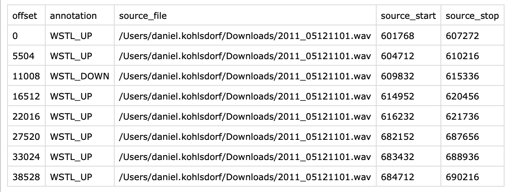

# Dolphin MNIST
A dataset creation tool for equally sized audio windows written in Java.
Below you can see the main user interface of the annotation tool.

The output of the program is an audio file with all the audio snippets:

As well as an annotation csv file:

