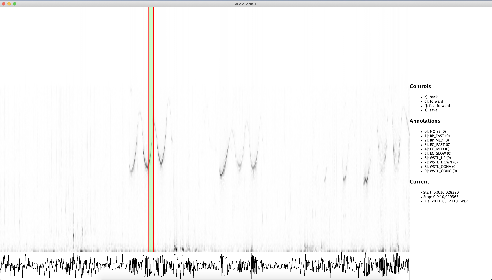
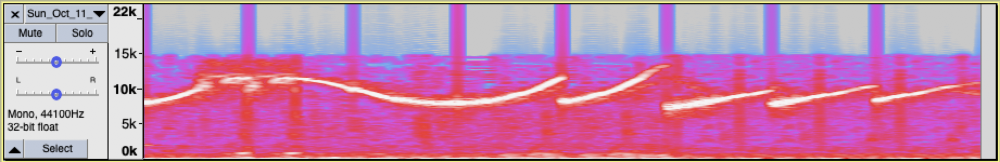

# --- Moved to https://github.com/dkohlsdorf/wdp-ds
# Dolphin MNIST
A dataset creation tool for equally sized audio windows written in Java.
Below you can see the main user interface of the annotation tool.

In the spectrogram you see the spectrogram with the
selected region highlighted. You can label that area
using the commands at the side. You can use the controls 
described at the side to navigate the spectrogram.
At the bottom you can see the raw audio.
The output of the program is an audio file with all the audio snippets:

